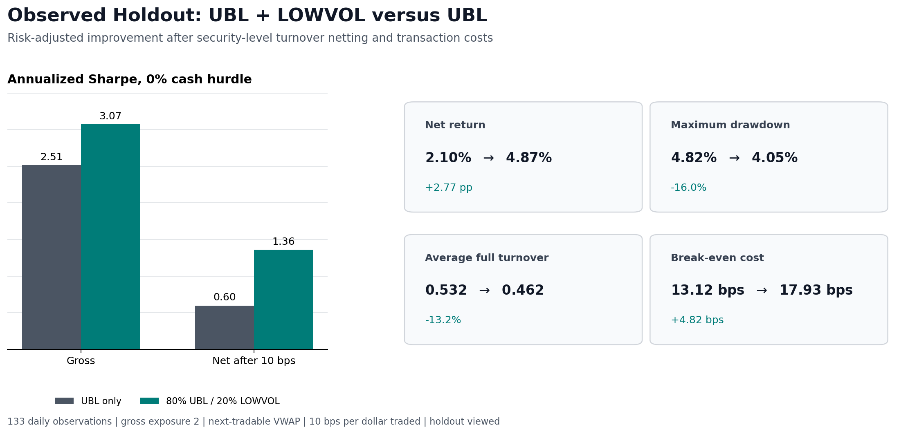
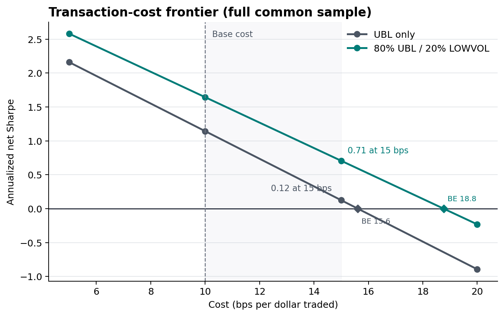
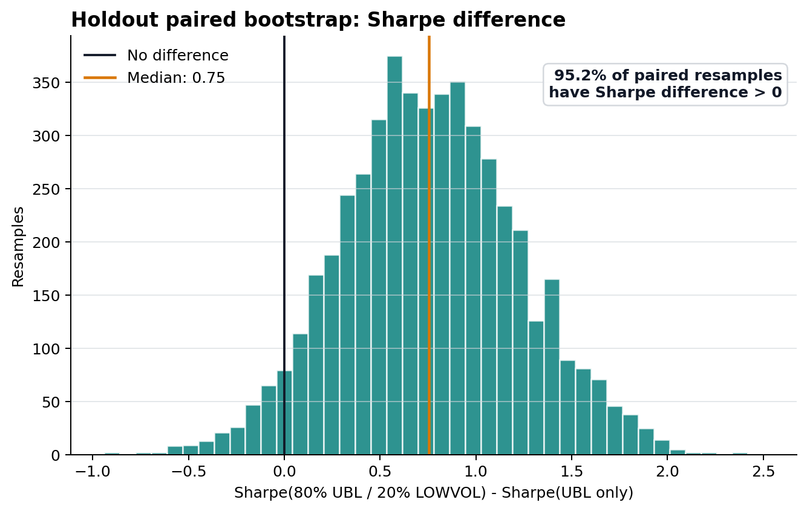

# Cross-Sectional Alpha Research: UBL + Low-Volatility Case Study

> A China A-share case study in point-in-time factor reconstruction, cost-aware
> portfolio construction, and robustness testing.

The research question is simple: can a slower low-volatility sleeve improve the
risk-adjusted performance and implementation economics of a short-horizon UBL
factor family without replacing its underlying signal?

The repository contains a documented portfolio study and a compact,
strategy-agnostic Python reference package. The public package begins with
precomputed, directionally oriented factor scores. Report-derived factor
implementations, licensed market data, security-level holdings, and the internal
research engine are not redistributed.

Reported results are simulated research results, not live performance or
investment advice.



## Result At A Glance

The chronological research holdout contains 133 daily observations. On this
period, the fixed 80% UBL / 20% LOWVOL portfolio raised annualized net Sharpe
from 0.60 to 1.36 under a 10 bps-per-dollar-traded cost model. It also produced
a higher net return, a shallower drawdown, lower average turnover, and a wider
estimated break-even cost margin.

| Observed holdout metric | UBL only | UBL + LOWVOL |
|---|---:|---:|
| Annualized gross Sharpe, 0% cash hurdle | 2.51 | 3.07 |
| Annualized net Sharpe, 0% cash hurdle | 0.60 | 1.36 |
| Net return | 2.10% | 4.87% |
| Maximum drawdown | 4.82% | 4.05% |
| Average full turnover | 0.532 | 0.462 |
| Break-even transaction cost | 13.12 bps | 17.93 bps |
| Five-day paired resamples with $\Delta \mathrm{Sharpe} > 0$ | - | 95.2% |

Gross Sharpe is reconstructed from the public net-return and transaction-cost
columns. Full turnover is
`sum_i abs(w_i,t - w_i,t-1)` for a dollar-neutral portfolio normalized
to long gross +1 and short gross -1.

> The holdout has now been viewed. It is observed chronological evidence, not
> an untouched out-of-sample test, and it cannot be reused for model selection.

The numerical inputs for this table are published in
[headline_metrics.csv](examples/sample_outputs/ubl_lowvol_study/data/headline_metrics.csv)
and
[portfolio_returns.csv](examples/sample_outputs/ubl_lowvol_study/data/portfolio_returns.csv).

## Research Path

The main contribution is the sequence of research decisions rather than one
performance statistic.

| Research question | Decision and evidence |
|---|---|
| Can the report-derived factor be evaluated without timing leakage? | Early same-period IC and group diagnostics were withdrawn. Active results require `latest_factor_input_timestamp < entry_timestamp < exit_timestamp` and next-tradable execution. |
| Is factor direction handled consistently? | Every strategy emits an oriented `alpha_score` for which a larger value means a higher expected return. Portfolio code never independently reverses a signal. |
| Are neighboring UBL parameters independent alphas? | Related variants were compared using score, RankIC, return, holding, and drawdown correlations. Redundant candidates were documented rather than counted as independent signals. |
| Can short-horizon rank information survive implementation? | Turnover was attributed by sleeve, side, trade event, liquidity, and size. A no-trade rule was selected on validation data and then frozen. |
| Does a second sleeve add economically distinct information? | Two conventional momentum definitions failed their pre-specified positive-direction tests. LOWVOL_60 entered only after a fixed portfolio-level inclusion test. |
| Is the improvement robust to one favorable path? | The final comparison includes cost stress, execution-delay stress, paired walk-forward folds, PnL concentration, exposure checks, and paired block bootstrap. |

The [UBL family study](docs/case_studies/UBL.md) describes the direction,
timing, redundancy, and implementation decisions. The
[candidate record](docs/candidate_outcomes.md) includes both selected and
rejected hypotheses.

## Evidence Across The Research Sample

The full common sample combines training, validation, and the viewed holdout.
It is supporting evidence rather than the headline comparison.

| Full-common-sample metric | UBL only | UBL + LOWVOL |
|---|---:|---:|
| Annualized net Sharpe, 0% cash hurdle | 1.14 | 1.64 |
| Net return | 13.58% | 19.20% |
| Maximum drawdown | 5.47% | 4.30% |
| Average full turnover | 0.552 | 0.482 |
| Top-five-day share of arithmetic net PnL | 60.9% | 43.9% |


The dashed boundaries identify validation and holdout starts. The continuous
path should not be read as one untouched investment test.


The blend's defensive contribution is visible in both drawdown depth and PnL
concentration, although performance remains uneven through time.

## Cost And Paired-Resampling Evidence

### Transaction-Cost Frontier



This is a full-common-sample stress test. At 15 bps per dollar traded, annualized
net Sharpe is 0.12 for UBL and 0.71 for the blend. Diamonds mark estimated
break-even costs of 15.61 and 18.77 bps. Both portfolios are negative at 20 bps.

### Paired Holdout Bootstrap



The displayed distribution uses 5,000 paired five-day moving-block resamples of
the 133 observed holdout dates. In 95.2% of those resamples, the blend's Sharpe
exceeds UBL's Sharpe. Across four pre-specified moving-block and stationary
schemes, the corresponding frequency ranges from 94.6% to 95.7%.

This is an observed-sample resampling frequency. It is not a probability that
the strategy will outperform or be profitable in the future.

## Robustness Boundaries

| Check | Result |
|---|---:|
| Validation annualized net Sharpe | 1.69 |
| Full-common-sample annualized net Sharpe | 1.64 |
| Full-common-sample net Sharpe at 15 bps | 0.71 |
| Paired walk-forward annualized net Sharpe | -0.07 |
| Positive paired walk-forward folds | 2 / 4 |
| One-additional-day execution-delay Sharpe | 0.46 |


The paired walk-forward result remains slightly negative, only two of four
folds are positive, and one additional execution day materially weakens the
portfolio. The holdout is short and regime-specific. These results make
unchanged-rule testing on new data more valuable than further tuning on the
current sample.

Other unresolved implementation limits are:

- no point-in-time stock-borrow inventory or financing model;
- no independently calibrated market-impact model;
- no independent verification of adjusted-price provenance or the pre-2020
  LOWVOL_60 warm-up inputs;
- no claim that the public aggregate bundle can reproduce the private
  security-level strategy.

## Portfolio Construction

The selected UBL family is treated as one top-level factor sleeve:

| UBL component | Internal risk budget |
|---|---:|
| PaperUBL 3D | 60% |
| UBL_M20 3D | 20% |
| UBL_M5 5D | 20% |

The top-level allocation is fixed at 80% UBL risk and 20% LOWVOL_60 risk.
Each sleeve is scaled using training-only realized portfolio volatility.
Security weights are then:

1. combined across sleeves before costs;
2. normalized to long gross +1 and short gross -1;
3. passed through the frozen 7.5 bps security-weight-change band;
4. checked against lifecycle and tradability rules;
5. charged transaction costs once on final aggregate trades.

Combining security weights before costs allows opposing sleeve trades to net.
The reported results do not average standalone net-return series.

The full timing, sample, cost, and metric definitions are in
[methodology.md](docs/methodology.md). The portfolio decision is discussed in
[the UBL + LOWVOL case study](docs/case_studies/ubl_lowvol_portfolio.md).

## Public Reference Package

The public code is a compact reference implementation for research that begins
with precomputed, directionally oriented factor scores. It supports:

- point-in-time timestamp validation and IC/RankIC analysis;
- dollar-neutral portfolio accounting and security-level weight ledgers;
- full and one-way turnover, transaction costs, Sharpe, and drawdown;
- paired moving-block bootstrap comparisons;
- reproducible figures and Markdown reports.

The runner enforces:

```text
latest_factor_input_timestamp < entry_timestamp < exit_timestamp
higher alpha_score = higher expected return
```

### Quick Start

Python 3.10 or newer is recommended.

```bash
git clone https://github.com/ywuwuwu/cross-sectional-alpha-research.git
cd cross-sectional-alpha-research
python -m venv .venv
source .venv/bin/activate
pip install -e ".[dev]"
python -m pytest -q
python examples/run_sample_package.py
```

The synthetic example writes a daily result table, security-level weight
ledger, summary JSON, four plots, and `report.md` under
`outputs/sample_package/`. Its performance is a mechanics check, not
an empirical claim.

### Input Contract

The generic runner expects one row per factor date and asset:

| Column | Meaning |
|---|---|
| `factor_date` | Date associated with the score |
| `latest_factor_input_timestamp` | Latest information used by the score |
| `entry_timestamp` | Simulated execution timestamp |
| `exit_timestamp` | Return-measurement endpoint |
| `asset` | Anonymous or public asset identifier |
| `alpha_score` | Oriented score; higher means better |
| `forward_return` | Realized return strictly after entry |

### Minimal API

```python
import pandas as pd

from alpha_research import BacktestConfig, Visualizer, run_cross_sectional_backtest

panel = pd.read_csv(
    "oriented_scores_and_returns.csv",
    parse_dates=[
        "factor_date",
        "latest_factor_input_timestamp",
        "entry_timestamp",
        "exit_timestamp",
    ],
)

result = run_cross_sectional_backtest(
    panel,
    BacktestConfig(
        long_fraction=0.20,
        short_fraction=0.20,
        cost_bps=10.0,
        band_bps=5.0,
    ),
)

Visualizer(result).save_report("outputs/example_report")
```

### Rebuild The Public Figures

All seven public result figures, including the six shown above, are generated
from the committed aggregate CSVs:

```bash
python examples/render_public_results.py
```

The complete figure bundle and data dictionary are in
[examples/sample_outputs/ubl_lowvol_study](examples/sample_outputs/ubl_lowvol_study/README.md).

## Public Evidence Boundary

The committed aggregate files support independent checks of the published
tables, figure regeneration, cost sensitivity, paired resampling, and
walk-forward comparisons. They contain no ticker identifiers.

They do not include licensed market data, report-derived factor
implementations, universe membership, private strategy parameters, borrow
inventory, or security-level portfolio inputs. They therefore do not permit an
independent rerun of the internal strategy.

## Documentation

- [Combined UBL + LOWVOL portfolio](docs/case_studies/ubl_lowvol_portfolio.md)
- [UBL factor family](docs/case_studies/UBL.md)
- [PaperUBL reconstruction](docs/case_studies/PaperUBL.md)
- [Candidate outcomes](docs/candidate_outcomes.md)
- [Methodology and metric definitions](docs/methodology.md)
- [Aggregate evidence bundle](examples/sample_outputs/ubl_lowvol_study/README.md)

## Optional Report-Reproduction Workflow

The
[factor research report reproducer](.agents/skills/factor-research-report-reproducer/SKILL.md)
provides an optional structure for literature review, assumption logging, factor
specification, and validation checklists. It is separate from the public
portfolio package and the internal security-level engine.

## License

Code, documentation, and released artifacts are covered by the
[MIT License](LICENSE). Published metrics are simulated research artifacts and
carry no warranty of investment performance.
